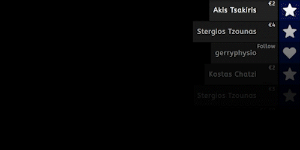

# 🎥 Streamlabs OBS Custom Event List  

Enhance your stream with a personalized **Event List widget**!  
This repository provides custom HTML, CSS, and JavaScript code to create a visually appealing and branded widget that displays real-time events such as follows, tips, subs, and hosts.  

Take your stream's aesthetics to the next level with this customizable solution!  

---

## ✨ Features  

- 🎨 **Customizable Design**: Match the widget's look to your stream's branding.  
- ⚡ **Real-Time Updates**: Displays live events as they happen.  
- 🔗 **Easy Integration**: Quick and seamless setup with Streamlabs OBS.  

---

## 👀 Preview  

Check out how your Event List will look on stream:  

  

---

## ⚙️ Installation  

### Step 1: Copy HTML, CSS, and JS Code  

Enable **Custom Code** in your Streamlabs Event List widget settings, then:  
- **HTML**: Paste the content of the `html.html` file into the **HTML** tab.  
- **CSS**: Paste the content of the `css.css` file into the **CSS** tab.  
- **JavaScript**: Paste the content of the `js.js` file into the **JS** tab.  

### Step 2: Save and Apply  

Once you've added the code to each tab, save your settings to see the widget live on your stream.  

---

## 📂 File Structure  

- **html.html**: Contains the structure of the widget.  
- **css.css**: Styles and layout for the Event List.  
- **js.js**: Adds interactive functionality and dynamic updates.  

---

## 📌 Notes  

- Be sure to test the widget in your Streamlabs preview window.  
- Customize the `css.css` and `js.js` files further to match your exact style preferences.  

---

## 🛠️ Resources  

- [Streamlabs Event List Widget Setup](https://streamlabs.com/content-hub/post/event-list-widget-setup)  
- [Add an Event List to Your Stream | FULL Tutorial](https://www.youtube.com/watch?v=GDUhy1XnNW4)  

---

🎉 **Happy streaming!**  
